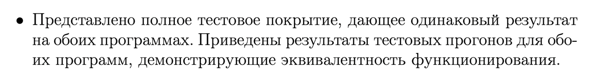
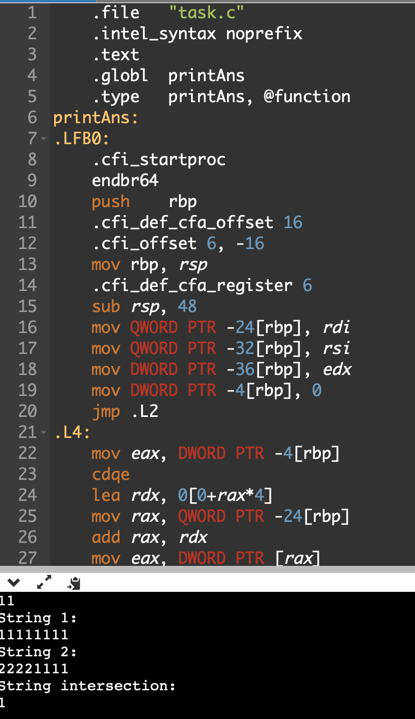
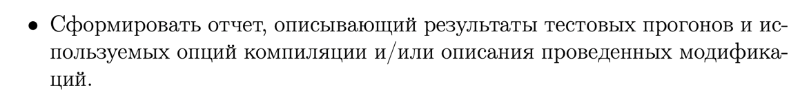

# ИДЗ №2 Андрей Гусев БПИ219

# Вариант #33


---
**Ограничения ввода:**

1) Вводятся строки, содержащие n (n <= 1 000 000) символов только из первой половины ASCII-таблицы (коды в диапазоне 0–127).
2) Ввод каждой строки заканчивается символом переноса строки (нажатием клавиши Enter).

---
###Критерий №4/10


- В проекте это файл `task.c`

---


- Компиляция без отладочных опций:

```gcc -O0 -masm=intel task.c -S -o task_1.s```

- После компиляции создался файл `task_1.s`, комментарии написаны в нём

---


- Использованы аргументы командой строки и ручное редактирование, получился файл `task1.s`

```gcc -O0 -Wall -masm=intel -S -fno-asynchronous-unwind-tables -fverbose-asm > -fcf-protection=none task.c```

---


- Программа скомпилирована и скомпонована без опций отладки

```gcc task1.s -o main```

---


**Тесты**

1) Ввод:

```
Hello world!
I like world!
```

Предполагаемый вывод:

```
String 1:
Hello world!
String 2:
I like world!
String intersection:
 !delorw
```

Вывод программы на C:


Вывод программы на GAS:


---

2) Ввод:

```
String 1:
qqqqqqqqqwwwwwwweeeeeee
String 2:
wwweeeeqeweqweqweqweqweqwewqeqweqwewqewq
String intersection:
eqw
```

Предполагаемый вывод:

```
Length is incorrect = 0
```

Вывод программы на C:


Вывод программы на GAS:


---

3) Ввод:

```
qweewqeqwewewqeqw
sadasdsasadsadadsasdasdsad
```

Предполагаемый вывод:

```
String 1:
qweewqeqwewewqeqw
String 2:
sadasdsasadsadadsasdasdsad
String intersection:

```

Вывод программы на C:


Вывод программы на GAS:

-

4) Ввод:

```


```

Предполагаемый вывод:

```
String 1:

String 2:

String intersection:

```

Вывод программы на C:


Вывод программы на GAS:


---

5) Ввод:

```
11111111
22221111
```

Предполагаемый вывод:

```
String 1:
11111111
String 2:
22221111
String intersection:
1
```
Вывод программы на C:


Вывод программы на GAS:


---

6) Ввод:

```
Quisque at augue et nisi interdum porta vel in neque. Maecenas ut ullamcorper dolor. Sed in elit imperdiet lorem ultrices rutrum eu eu erat. Pellentesque habitant morbi tristique senectus et netus et malesuada fames ac turpis egestas. Sed et arcu eu purus elementum posuere. Donec condimentum purus eu accumsan lacinia. Quisque elementum nibh id placerat viverra. Ut at fermentum nulla, id pulvinar arcu. Vivamus at dapibus lectus, eget dignissim dolor. Donec viverra enim in tempus molestie. Donec vitae felis lacus. In hac habitasse platea dictumst. Duis nec volutpat eros, eget dictum nisl. Fusce augue est, pulvinar vitae mi sit amet.
Donec ac pharetra lectus. Duis euismod diam vel cursus blandit. Curabitur convallis ex ut bibendum ultrices. Curabitur tempus luctus leo, sed euismod sapien commodo a. Sed vehicula massa id risus sodales fermentum. Donec mauris odio, accumsan id fermentum et, dapibus id massa. Curabitur feugiat molestie lorem sed molestie. Praesent pharetra ornare nibh. Donec blandit gravida neque ac facilisis. Vestibulum porta bibendum neque, quis semper felis interdum at. Ut elementum vel nibh eget malesuada. Nunc cursus interdum turpis vel commodo. Aliquam elementum sapien sit amet ipsum aliquet finibus sit amet id nunc. In facilisis ipsum purus, vel volutpat arcu scelerisque eu.
```

Предполагаемый вывод:

```
String 1:
Quisque at augue et nisi interdum porta vel in neque. Maecenas ut ullamcorper dolor. Sed in elit imperdiet lorem ultrices rutrum eu eu erat. Pellentesque habitant morbi tristique senectus et netus et malesuada fames ac turpis egestas. Sed et arcu eu purus elementum posuere. Donec condimentum purus eu accumsan lacinia. Quisque elementum nibh id placerat viverra. Ut at fermentum nulla, id pulvinar arcu. Vivamus at dapibus lectus, eget dignissim dolor. Donec viverra enim in tempus molestie. Donec vitae felis lacus. In hac habitasse platea dictumst. Duis nec volutpat eros, eget dictum nisl. Fusce augue est, pulvinar vitae mi sit amet.
String 2:
Donec ac pharetra lectus. Duis euismod diam vel cursus blandit. Curabitur convallis ex ut bibendum ultrices. Curabitur tempus luctus leo, sed euismod sapien commodo a. Sed vehicula massa id risus sodales fermentum. Donec mauris odio, accumsan id fermentum et, dapibus id massa. Curabitur feugiat molestie lorem sed molestie. Praesent pharetra ornare nibh. Donec blandit gravida neque ac facilisis. Vestibulum porta bibendum neque, quis semper felis interdum at. Ut elementum vel nibh eget malesuada. Nunc cursus interdum turpis vel commodo. Aliquam elementum sapien sit amet ipsum aliquet finibus sit amet id nunc. In facilisis ipsum purus, vel volutpat arcu scelerisque eu.
String intersection:
 ,.DIPSUVabcdefghilmnopqrstuv
```

Вывод программы на C:


Вывод программы на GAS:


---

---


- Сделал.

---

###Критерий №5/10


- Функции с передачей данных через параметры использованы (файл `task.c`)

```c
void printAns(int arr1[], int arr2[], int size) {
    for (int i = 0; i < size; i++) {
        if (arr1[i] && arr2[i]) {
            printf("%c", (char)i);
        }
    }
}
```

---


- Локальные переменные использованы

```c
char s1[1000000];
char s2[1000000];
int used1[128] = {0};
int used2[128] = {0};
int i = 0;
int curr;
```

---


- В ассемблерную программу при вызове функции добавлены комментарии, описывающие передачу фактических параметров и
  перенос возвращаемого результата. Это можно увидеть в файле task1.s

---


- В функциях для формальных параметров добавлены комментарии, описывающие связь между параметрами языка Си и
  регистрами (стеком). Это можно увидеть в фале task1.s

---


- Информация добавлена в отчёт
